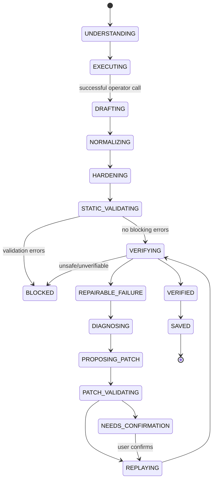
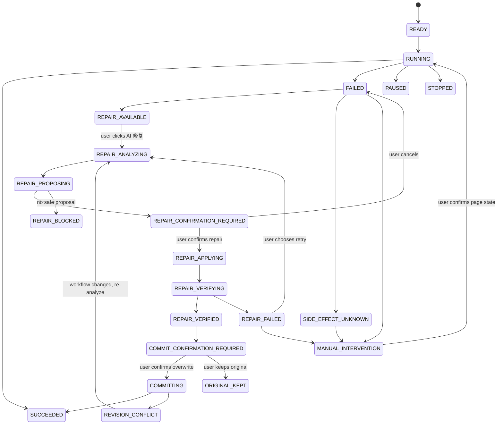
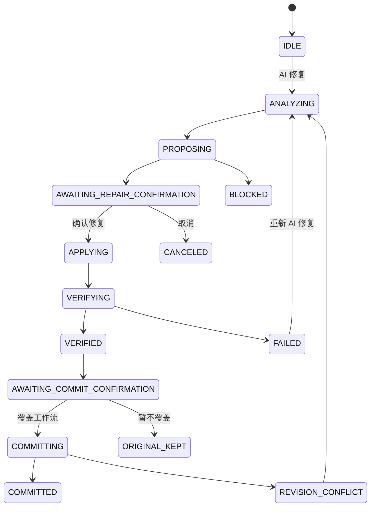

# Browser Copilot Workflow Generation & AI Recovery UX/Architecture Spec

> 状态：Proposed
>
> 目标分支：`develop`
>
> 目标读者：Coding Agent / AI Engineer / Frontend Engineer / Workflow Engine Engineer
>
> 文档目的：把当前 Browser Copilot 已有的 Workflow Generation、Validation、Repair、Checkpoint/Resume 能力收敛成一套可执行的工程方案，让“生成出来的工作流”从一次性 action recording，升级为可重复执行、可验证、可恢复、可维护的 Workflow Program。

---

## 0. 执行摘要

### 0.1 核心判断

当前 `develop` 已具备一批正确的底层能力：

- 工作流生成工具会先在真实页面执行 block，只有执行成功才将节点写入 `WorkflowDraft`，即“记录真实发生过的成功操作”。
- Generated Workflow 已有严格静态校验：图结构、数据流、Locator、Readiness、副作用、Goal 六层。
- Generated workflow 可以使用 `generated-strict` 可靠性模式。
- Reliability contract 已支持 `preconditions / postconditions / readiness / locator`。
- Repair Engine 已统一为 `ANALYZE / SUGGEST / AUTO_REPAIR`。
- Repair 首轮执行是 takeover-free，诊断基于真实 execution trace；AUTO_REPAIR 走 proposal → validation → working copy → replay → verification。
- Workflow Runner 已支持 checkpoint/resume，并对 `SIDE_EFFECT_UNKNOWN` 做安全拦截，避免不可逆操作重复执行。

这些设计方向应保留。

### 0.2 当前产品层面的主要问题

主要问题不是“AI 能力不足”，而是 AI 能力暴露得过多，用户必须理解内部 repair 能力之间的区别。

当前容易形成：

```text
AI 调试 / AI 分析 / AI 修复 / AI 建议 / 继续运行
          ↓
用户需要自己选择“现在该点哪个”
```

本 Spec 的产品决策是：**用户只需要一个 AI 入口：`AI 修复`。**

点击 `AI 修复` 后，系统自动完成：

```text
AI 修复
  ↓
自动诊断
  ↓
自动生成修复方案
  ↓
展示证据 + diff + 风险
  ↓
用户确认“确认修复”
  ↓
应用到 working copy
  ↓
Replay / Verify
  ↓
展示修复结果
  ↓
用户确认“覆盖工作流”
  ↓
Commit 新 revision
```

因此：

- `ANALYZE / SUGGEST / AUTO_REPAIR` 是内部 engine phase，不是用户操作。
- `diagnose / show-proposal / resume / takeover` 可以继续作为后台能力，但不作为 Workflow 面板的 AI 一级按钮。
- 用户不需要判断先分析、再建议还是直接修复；系统负责 orchestration。
- 用户只在两个真正需要人做决定的地方确认：**是否执行修复**、**是否覆盖正式 Workflow**。

### 0.3 总体目标

把 Workflow 生命周期升级成：

```text
Task Understanding
      ↓
Live Execution
      ↓
Workflow Draft
      ↓
Normalize
      ↓
Harden Locator
      ↓
Build Reliability Contract
      ↓
Generated Validation
      ↓
Independent Verification
      ↓
Save as Verified Workflow
      ↓
Run
      ↓
Failure Classification
      ↓
Deterministic Recovery / AI Repair
      ↓
Replay
      ↓
Independent Verification
      ↓
Commit Repair OR Escalate
```

### 0.4 最重要的产品原则

1. **Workflow 是 Program，不是 action list。**
2. **AI 可以提出修改，但“修好了”只能由独立验证证明。**
3. **优先确定性恢复，再使用 AI。**
4. **AI takeover 是本次运行的救援，不等于 Workflow 修复。**
5. **不能安全重放的副作用必须停止并请求人工确认。**
6. **前端只暴露一个 AI 一级入口：`AI 修复`；分析、建议、修复、验证由系统自动编排。**
7. **任何生成出来的 Workflow 都必须知道“什么叫成功”。**
8. **生成阶段重点提升泛化能力，而不只是把这一次操作录下来。**
9. **所有 Repair 都基于 working copy，未经验证不得覆盖正式 Workflow。**
10. **状态驱动 UI，禁止固定展示一组相互语义重叠的 AI 按钮。**

---

# 1. 代码基线与现状审计

> 本节只记录当前 `develop` 已确认的能力，以及本 Spec 对现有能力的继承关系。GitHub 文件均以 `develop` 分支为目标路径；访问时间为本次审计时可读取的最新源码。

## 1.1 当前生成链路

核心文件：

- `src/background/operator-tool-handler.ts`
- `src/background/operator-tool-run.ts`
- `src/lib/workflow/generated-validation.ts`
- `src/lib/workflow/reliability.ts`

当前生成器的正确原则是：

```text
LLM 决定下一步
    ↓
真实执行 block
    ↓
block 成功
    ↓
append WorkflowDraft
```

`operator-tool-handler.ts` 明确规定：workflow operator 的工具调用会执行真实 block，只有成功执行后才追加 WorkflowDraft，因此生成结果不是“模型脑补出来的 JSON”。

这项能力属于 P0 基础能力，禁止改成“先生成整个 Graph，再验证页面是否存在”。

## 1.2 当前 Generated Validation

核心文件：

- `src/lib/workflow/generated-validation.ts`

目前已经存在六层静态验证：

| 层级 | 检查内容 |
|---|---|
| A | Graph：连通性、可达性、孤儿子图 |
| B | Data：变量 / 表达式引用的数据流 |
| C | Locator：元素操作必须有可靠定位，拒绝仅位置定位 |
| D | Readiness：前后状态契约、timeout 合法性 |
| E | Side Effect：不可逆动作需要幂等信息 + postconditions |
| F | Goal：严格生成模式必须有可验证目标 |

目标：保留现有六层模型，并把它从“检查器”升级为“生成 pipeline 的正式 gate”。

## 1.3 当前 Reliability Contract

核心文件：

- `src/lib/workflow/reliability.ts`

当前 Node Reliability 已支持：

```ts
interface NodeReliabilitySpec {
  preconditions?: WorkflowCondition[]
  postconditions?: WorkflowCondition[]
  readiness?: ReadinessSpec
  locator?: NodeLocatorSpec
}
```

当前 `generated-strict` 会对生成来源进行严格约束，并且不可逆动作需要 goal / postconditions 才能判断“动作完成后真的发生了”。

本 Spec 直接复用该模型，不重新设计第二套 reliability schema。

## 1.4 当前 Repair Engine

核心文件：

- `src/background/workflow-engine/repair/unified-debug.ts`
- `src/background/workflow-engine/repair/`

当前 engine mode：

```ts
type UnifiedDebugMode = 'ANALYZE' | 'SUGGEST' | 'AUTO_REPAIR'
```

当前统一修复流程已经具备：

```text
first pass: takeover-free execution
       ↓
deterministic diagnosis
       ↓
transient retry（非 ANALYZE）
       ↓
AI minimal patch proposal
       ↓
patch validation
       ↓
working copy
       ↓
replay
       ↓
independent verification
```

该结构是未来的核心 Repair Engine，应保留，不应再新增 `debug2 / aiFix2 / smartRepair` 等平行实现。

## 1.5 当前 Resume / Side-effect Safety

核心文件：

- `src/background/workflow-engine/run-workflow.ts`
- checkpoint 相关模块

当前 Runner 已支持：

- checkpoint
- `resumeFrom`
- 恢复变量上下文
- 从最后成功位置继续运行
- 检测 generation origin 与当前页面 origin 不一致时给出提示
- `SIDE_EFFECT_UNKNOWN` 时拒绝自动重放

这是本 Spec 中“从这里继续”的基础设施。

---

# 2. 产品目标

## 2.1 用户目标

用户应该能够：

1. 用一次真实操作生成一个可重复运行的 Workflow。
2. 生成后知道 Workflow 是否真的可运行，而不仅仅知道“JSON 生成成功”。
3. Workflow 失败时立即知道失败发生在哪一步、根因是什么、是否可以安全修复。
4. 用户无需理解 `ANALYZE / SUGGEST / AUTO_REPAIR`。
5. AI 修复时，不直接污染正式 Workflow。
6. 修复完成必须自动验证。
7. 如果任务已经执行了一部分，可以安全地从 checkpoint 继续。
8. 对重复提交、支付、删除、发送、登录等不可逆行为提供安全保护。

## 2.2 工程目标

### P0

- 提升 Generated Workflow 首次独立验证通过率。
- 降低因 selector stale / readiness / transient / resume 导致的失败。
- 将 Repair Engine 与 UI 状态机统一。
- 让 AI 修复变成最小 patch，而不是重写整个 Workflow。
- 所有 Repair 结果都可追溯。

### P1

- Semantic Target + 多 fallback locator。
- 生成后 Normalize。
- 自动生成 preconditions / postconditions。
- Workflow Health。
- 动态 Repair Budget。
- 多次成功运行后的变量泛化 / workflow generalization。

### P2

- 基于历史运行生成稳定性趋势。
- 自动聚类 failure patterns。
- 相同站点 / 相同 Workflow 的 repair pattern 复用。
- Repair knowledge cache。

---

# 3. 非目标

本 Spec 当前不要求：

- 重写完整 Workflow Engine。
- 替换 Drawflow / 当前 canvas。
- 引入外部云端 workflow orchestration backend。
- 把 AI takeover 变成默认执行机制。
- 自动修改用户已保存的 Workflow 而无需 verification。
- 让模型完全自由地产生任意 Workflow JSON。
- 一次性实现跨浏览器支持。

---

# 4. 总体目标架构

## 4.1 目标模块

```text
src/
├─ background/
│  ├─ operator-tool-handler.ts          # 现有：真实执行并记录 draft
│  ├─ workflow-engine/
│  │  ├─ run-workflow.ts                # 现有 Runner / checkpoint / resume
│  │  ├─ generation/
│  │  │  ├─ normalize.ts                # NEW
│  │  │  ├─ harden.ts                   # NEW
│  │  │  ├─ generate-contract.ts        # NEW
│  │  │  └─ generation-pipeline.ts      # NEW
│  │  └─ repair/
│  │     ├─ unified-debug.ts             # MODIFY / 保留唯一 repair engine
│  │     ├─ failure-classifier.ts        # NEW
│  │     ├─ recovery-plan.ts             # NEW
│  │     ├─ repair-policy.ts             # MODIFY
│  │     └─ verification-runner.ts       # EXISTING / MODIFY
│  └─ workflow-ui-controller.ts          # NEW/REFACTOR
│
├─ lib/
│  └─ workflow/
│     ├─ types.ts
│     ├─ reliability.ts                  # EXTEND
│     ├─ generated-validation.ts          # EXTEND
│     ├─ checkpoints.ts
│     └─ repair/
│        ├─ types.ts                     # EXTEND
│        ├─ confirmation-gate.ts
│        ├─ transient-retry.ts
│        └─ prompts.ts                   # NEW
│
└─ panel/ / sidepanel/                   # 按实际仓库目录定位 UI
   ├─ workflow-run-panel.*
   ├─ workflow-failure-center.*          # NEW/REFACTOR
   └─ workflow-status.*                  # NEW
```

> Coding Agent 必须先通过搜索确认实际前端目录和文件名，不得机械创建上述占位路径；但模块边界应保持一致。

---

# 5. Workflow 生命周期状态机

## 5.1 Generation State Machine



## 5.2 Runtime State Machine

运行层状态与 AI 修复层状态分离。普通执行仍然使用现有 Runner；失败后才进入 Repair Flow。

### 5.2.1 Runtime 主状态



### 5.2.2 AI Repair 子状态

AI Repair 必须是一个单入口、多阶段 orchestration，而不是多个用户动作：



### 5.2.3 设计约束

- Diagnose 与 Proposal 必须在同一次 `AI 修复` session 中自动串行完成。
- Proposal ready 后必须暂停等待用户确认；不得自动应用 patch。
- Verification 通过后必须暂停等待用户确认；不得自动覆盖正式 Workflow。
- 同一 `runId + workflowRevision` 只能存在一个 active repair session。

## 5.3 状态定义

| 状态 | 用户看到的文案 | 用户操作 |
|---|---|---|
| `READY` | 准备运行 | 运行 |
| `RUNNING` | 正在运行 | 暂停 / 停止 |
| `SUCCEEDED` | 已完成 | 查看结果 / 再次运行 |
| `FAILED` | 运行失败 | **AI 修复** |
| `REPAIR_ANALYZING` | AI 正在分析问题 | 无，等待 |
| `REPAIR_PROPOSING` | AI 正在生成修复方案 | 无，等待 |
| `REPAIR_CONFIRMATION_REQUIRED` | 已找到修复方案 | **确认修复 / 取消** |
| `REPAIR_APPLYING` | 正在应用修复 | 无，等待 |
| `REPAIR_VERIFYING` | 正在验证修复 | 无，等待 |
| `REPAIR_VERIFIED` | 修复已验证通过 | **覆盖工作流 / 暂不覆盖** |
| `REPAIR_FAILED` | 修复未通过验证 | **重新 AI 修复 / 编辑 Workflow** |
| `SIDE_EFFECT_UNKNOWN` | 操作结果未知，无法安全自动处理 | 人工检查 |
| `REVISION_CONFLICT` | Workflow 已发生变化 | 重新 AI 修复（重新分析） |
| `BLOCKED` | 无法安全自动修复 | 编辑 Workflow / 人工处理 |

> 关键约束：除正常 Workflow 运行控制之外，AI 能力在 Workflow 面板中只提供一个一级入口 `AI 修复`。`诊断`、`建议`、`takeover`、`resume` 不再以独立 AI 按钮暴露。

# 6. Workflow 生成新流程

## 6.1 目标 Pipeline

必须实现为明确的 pipeline：

```text
1. Understand
2. Execute
3. Record
4. Normalize
5. Generalize Inputs
6. Harden Targets
7. Build Reliability Contract
8. Static Validate
9. Independent Verify
10. Persist
```

## 6.2 Understand

输入：

- 用户原始任务
- 当前 URL / origin
- 当前页面 snapshot / selection（如已有）
- 用户在生成期间实际完成的动作

输出：

```ts
interface TaskIntent {
  summary: string
  goal: GoalSpec
  inputCandidates: InputCandidate[]
  sideEffects: SideEffectClass[]
  expectedOutcome?: string
}
```

规则：

- 如果用户目标不清晰，不能靠猜完成危险任务。
- 对不可逆动作必须尽可能生成可观测的 goal。
- 不要求每一个只读 Workflow 都强制写 goal，但要保证“可验证性不被伪装成成功”。

## 6.3 Execute / Record

保留当前 `operator-tool-handler.ts` 真实执行后记录的机制。

禁止：

```text
LLM 输出完整 Workflow JSON
→ 不执行
→ 标记 generated
```

必须保持：

```text
LLM tool call
→ live execution
→ success
→ append draft
```

## 6.4 Normalize

新增 `workflow/generation/normalize.ts`。

### 目标

把“人类为完成一次任务做出的所有动作”转换成“未来运行所需的最小程序”。

### 必须检测

- 连续重复 click。
- 多余 delay。
- 重复 navigation。
- 因页面观察产生但不是业务意图的动作。
- 同一元素重复 fill。
- 无效的 hover / scroll。
- 纯粹由模型试探产生的动作。
- 可以由 precondition/readiness 替代的 delay。
- 应该由 variable 替代的硬编码值。

### 输出

```ts
interface NormalizationResult {
  workflow: Workflow
  removedNodes: string[]
  mergedNodes: string[]
  variableCandidates: InputCandidate[]
  notes: NormalizationNote[]
}
```

### 原则

Normalize 只允许：

- 删除可证明多余节点；
- 合并等价节点；
- 提升变量抽象；
- 加强可靠性 metadata。

不得改变已经验证过的业务语义。

## 6.5 Generalize Inputs

新增输入泛化阶段。

例如：

```text
实际执行：搜索 “iPhone 17 Pro Max”

Workflow：
searchKeyword = {{keyword}}
```

而不是：

```text
searchKeyword = "iPhone 17 Pro Max"
```

### 输入候选来源

- 用户原始 prompt 中的参数。
- 录制时重复出现且语义一致的值。
- 当前 trigger parameters。
- 明显的业务实体值：订单号、关键词、日期、商品名等。

### 禁止泛化

密码、secret、token、cookie、session id 等敏感数据不得进入 LLM 提示或普通 Workflow variable。

## 6.6 Harden Targets

新增 `workflow/generation/harden.ts`。

### 目标

把 selector 从“当前 DOM 可用”升级成“语义稳定、可探测、可 fallback”。

### Node Locator 目标模型

```ts
interface SemanticTarget {
  role?: string
  name?: string
  text?: string
  ariaLabel?: string
  placeholder?: string
  label?: string
  near?: string
  container?: string
}

interface LocatorCandidate {
  kind: 'semantic' | 'css' | 'xpath' | 'text'
  value: string
  confidence: number
  evidence?: string[]
}

interface NodeLocatorSpecV2 {
  semantic?: SemanticTarget
  candidates: LocatorCandidate[]
  preferred: 'semantic' | 'css' | 'xpath' | 'text'
  probe?: {
    matched: boolean
    matchCount: number
    observedAt: number
  }
}
```

### Locator 优先级

```text
1. Semantic identity
2. Stable aria / label / name
3. Stable CSS
4. XPath
5. Text
```

严格模式拒绝：

```text
:nth-child()
仅 index
仅位置描述
动态 class hash
明显 generated class
```

除非同时存在稳定语义 fallback。

### 运行时 Resolver

不要让每个 block 自己发明 fallback 逻辑。

新增：

```ts
resolveWorkflowTarget(node, pageContext): ResolvedTarget
```

统一返回：

```ts
interface ResolvedTarget {
  locator: LocatorCandidate
  element: ElementHandle
  confidence: number
  matchCount: number
  usedFallback: boolean
}
```

## 6.7 Reliability Contract Generation

对每个可交互节点生成：

```ts
interface NodeReliabilitySpec {
  preconditions?: WorkflowCondition[]
  postconditions?: WorkflowCondition[]
  readiness?: ReadinessSpec
  locator?: NodeLocatorSpec
}
```

目标模式：

```text
Action
  ↓
Preconditions
  ↓
Readiness
  ↓
Action
  ↓
Postconditions
```

### readiness 优先级

```text
element.present
→ element.visible
→ element.enabled
→ value.committed
→ navigation.settled
→ app-specific ready state
```

不要通过增加 `delay: 2000` 解决 readiness 问题，除非没有更可靠的可观测状态。

## 6.8 Goal Generation

Goal 分两类：

### Read-only goal

可选。

### Unsafe / irreversible goal

必须生成。

例如：

```ts
interface GoalSpec {
  summary: string
  successConditions: WorkflowCondition[]
  terminalStateConditions?: WorkflowCondition[]
}
```

示例：

```json
{
  "summary": "提交订单成功",
  "successConditions": [
    {
      "type": "element-visible",
      "target": {
        "text": "订单提交成功"
      }
    }
  ]
}
```

## 6.9 Static Validate

继续使用现有六层 validation，并新增：

- normalized node policy
- semantic target completeness
- locator fallback validity
- pre/post condition overlap
- unsafe action goal coverage
- variable generalization sanity
- repair metadata integrity

## 6.10 Independent Verify

生成成功定义为：

```text
Static validation passed
AND
Independent verification passed
AND
Goal passed when goal exists
```

禁止：

```text
LLM 回复“看起来成功了”
→ Workflow=VERIFIED
```

---

# 7. Generation 数据模型

## 7.1 WorkflowGenerationSession

```ts
interface WorkflowGenerationSession {
  id: string
  conversationId?: string
  startedAt: number
  finishedAt?: number

  source: 'record' | 'chat-execution' | 'manual'
  originUrl?: string
  originOrigin?: string

  taskIntent: TaskIntent
  draft?: Workflow
  normalized?: Workflow

  validation?: GeneratedValidationReport
  verification?: VerificationResult

  status:
    | 'UNDERSTANDING'
    | 'EXECUTING'
    | 'DRAFTING'
    | 'NORMALIZING'
    | 'HARDENING'
    | 'VALIDATING'
    | 'VERIFYING'
    | 'VERIFIED'
    | 'BLOCKED'
    | 'FAILED'

  telemetry: {
    actionCount: number
    removedActionCount: number
    generatedVariableCount: number
    hardenedLocatorCount: number
    validationErrorCount: number
    verificationAttempts: number
  }
}
```

## 7.2 FailureAnalysis

现有 `FailureAnalysis` 继续复用，并至少补充：

```ts
interface FailureAnalysisV2 extends FailureAnalysis {
  category:
    | 'TIMING'
    | 'LOCATOR'
    | 'PAGE_STATE'
    | 'NAVIGATION'
    | 'DATA'
    | 'AUTH'
    | 'CAPTCHA'
    | 'SIDE_EFFECT'
    | 'NETWORK'
    | 'PROVIDER'
    | 'STRUCTURAL'
    | 'UNKNOWN'

  recoverability:
    | 'AUTO'
    | 'SUGGEST'
    | 'RESUME'
    | 'HUMAN'
    | 'BLOCKED'

  confidence: number

  evidence: FailureEvidence[]

  affectedNodeIds: string[]
  safeResumePoint?: ResumePoint
  recommendedAction: RecoveryAction
}
```

## 7.3 RecoveryAction

```ts
interface RecoveryAction {
  id: string
  type:
    | 'RETRY'
    | 'RESUME'
    | 'DIAGNOSE'
    | 'PATCH_AND_VERIFY'
    | 'SHOW_PROPOSAL'
    | 'TAKEOVER'
    | 'ASK_HUMAN'
    | 'EDIT_WORKFLOW'
  label: string
  reason: string
  safe: boolean
  requiresConfirmation: boolean
}
```

---

# 8. Failure Classification

## 8.1 必须统一 Failure Class

| Class | 典型问题 | 默认处理 |
|---|---|---|
| `TIMING` | 元素晚出现 | readiness / retry |
| `LOCATOR` | selector stale | AI patch / resolver |
| `PAGE_STATE` | 页面状态不对 | diagnose / recover |
| `NAVIGATION` | 未完成导航 | wait / resume |
| `DATA` | 变量为空 / 类型错误 | patch / input fix |
| `AUTH` | 登录过期 | 人工 / re-auth |
| `CAPTCHA` | CAPTCHA 阻塞 | 人工 |
| `SIDE_EFFECT` | 结果未知 | 人工确认 |
| `NETWORK` | 请求失败 | transient retry |
| `PROVIDER` | AI/model/provider 错误 | fallback / retry |
| `STRUCTURAL` | graph 错误 | workflow edit / repair |
| `UNKNOWN` | 无法确定 | diagnose + human |

## 8.2 Classification 原则

Failure classifier 优先读取：

1. Runner structured error code。
2. Node block type。
3. Trace。
4. Page state probe。
5. Checkpoint metadata。
6. 最后才允许 AI 判断。

不要直接让 LLM 读取一段错误字符串后自由输出 failure type。

## 8.3 Evidence

```ts
interface FailureEvidence {
  type:
    | 'runner-error'
    | 'trace'
    | 'dom-probe'
    | 'navigation'
    | 'checkpoint'
    | 'locator-probe'
    | 'goal-check'
    | 'ai-observation'
  summary: string
  value?: string
  confidence?: number
}
```

---

# 9. Repair Engine 目标设计

## 9.1 唯一 Repair Engine

继续使用：

```ts
runUnifiedDebug(workflow, mode, deps)
```

但新增一层用户友好的 orchestration：

```ts
recoverWorkflowRun(input): Promise<RecoveryResult>
```

该 orchestration 决定：

- retry
- resume
- diagnose
- patch
- takeover
- human confirmation

而不是让 UI 直接调用不同的 engine mode。

## 9.2 目标 Recovery Pipeline

用户只执行一次：

```text
点击 AI 修复
```

后台自动执行：

```text
Failure
  ↓
Structured Classification
  ↓
Diagnose
  ↓
Generate minimal repair proposal
  ↓
Patch validation
  ↓
等待用户“确认修复”
  ↓
Apply to working copy
  ↓
Replay from safe checkpoint
  ↓
Independent verification
  ↓
等待用户“覆盖工作流”
  ↓
Commit new revision
```

### 9.2.1 两个用户确认点

**确认点 1：执行修复**

AI 只能提出方案；没有用户确认，不得修改 working copy，也不得进行 repair replay。

**确认点 2：覆盖正式 Workflow**

即使 repair verification 已通过，也不得自动覆盖正式 Workflow。必须展示 patch diff、验证结果和 revision 信息，由用户明确确认后 commit。

### 9.2.2 特殊情况

- `SIDE_EFFECT_UNKNOWN`：自动诊断可以继续，但必须在执行任何可能重复副作用的 repair/replay 前停止。
- `AUTH / CAPTCHA / HUMAN_REQUIRED`：AI Repair 可以给出诊断和建议，但不绕过人工安全边界。
- 无安全 patch：直接进入 `BLOCKED`，不尝试“为了成功而修改 goal / postcondition”。
- verification 失败：保留原 Workflow 不变；允许用户再次点击同一个 `AI 修复`，开始新一轮 diagnosis。

## 9.3 Repair 必须最小化

Patch 目标：

```text
只改会导致失败的最小节点集合
```

Patch 禁止：

- 整体重写 graph。
- 无关节点重新排序。
- 修改用户输入值，除非输入本身就是根因。
- 删除未受影响的节点。
- 修改副作用策略而没有确认。

---

# 10. AI Prompt 规范

所有 Prompt 必须要求 JSON schema 输出；不要依赖自由文本解析。

## 10.1 Prompt A：Workflow Normalize

```text
SYSTEM:
你是 Browser Copilot Workflow Normalizer。
你的职责不是重新设计用户任务，而是把一次已经真实成功执行的浏览器操作序列，
转换成最小、可重复、可验证的 Workflow Program。

严格规则：
1. 只删除、合并或抽象“可证明非业务必要”的动作。
2. 不改变用户已经完成的业务语义。
3. 不把位置点击升级成业务规则，除非证据充分。
4. 优先使用 readiness/preconditions 替代固定 delay。
5. 将稳定且可变的业务数据识别为 input candidate。
6. 不输出密码、token、cookie、secret 等敏感值。
7. 对不可逆动作必须声明可观察的 postcondition。
8. 任何不确定的修改都保持原样，并通过 note 标记。

输入：
- original user task
- executed action trace
- current workflow draft
- page evidence

输出 JSON：
{
  "removedNodeIds": [],
  "mergedNodeGroups": [],
  "inputCandidates": [],
  "reliabilityEnhancements": [],
  "notes": [],
  "confidence": 0
}
```

## 10.2 Prompt B：Failure Diagnose

```text
SYSTEM:
你是 Browser Copilot Workflow Failure Diagnostician。
你的任务是根据真实执行 trace、结构化错误、DOM probe、checkpoint 和 workflow 定义，
判断最可能的根因，不允许凭经验臆测不存在的证据。

优先级：
1. structured runner error
2. observable page state
3. trace chronology
4. locator probe
5. checkpoint state
6. AI inference

必须输出：
- failureCategory
- rootCauseNodeIds
- affectedNodeIds
- confidence
- evidence[]
- recoverability
- recommendedAction
- safeResumePoint

若证据不足，输出 UNKNOWN，而不是编造结论。
```

## 10.3 Prompt C：Minimal Repair Patch

```text
SYSTEM:
你是 Browser Copilot Workflow Repair Agent。
你只能输出最小可验证 WorkflowPatchSet。

规则：
1. 修改范围必须覆盖根因，但不能扩大到无关节点。
2. 优先修 locator / readiness / data contract。
3. 优先补充语义定位器，不要退化为 positional selector。
4. 不得删除 goal / postcondition 以绕过验证。
5. 不得关闭 strict validation。
6. 不得把 side-effect-unknown 强行标记为成功。
7. 每个 patch 必须有 reason、confidence、risk 和 expectedVerification。
8. 若无法提出安全 patch，返回 null。

输出：
{
  "patches": [],
  "confidence": 0,
  "risk": "LOW|MEDIUM|HIGH",
  "reason": "",
  "expectedVerification": []
}
```

## 10.4 Prompt D：Takeover / 本次运行救援

```text
SYSTEM:
你正在进行 Browser Copilot 当前运行的 Live Recovery。

目标：帮助本次运行完成失败步骤，不修改正式 Workflow。

约束：
1. 只处理当前失败节点及其必要前置状态。
2. 不修改保存的 Workflow。
3. 不重复执行结果未知的不可逆动作。
4. 如果页面已经显示该动作完成，必须优先观察并返回“已完成”，不得再次提交。
5. 完成后必须返回可观测证据。
6. 此次 takeover 成功不代表 Workflow 已修复。
```

## 10.5 Prompt E：Repair Proposal Explanation

UI 不直接显示模型原始推理，只允许显示结构化结果：

```json
{
  "summary": "原按钮定位器已失效",
  "evidence": [
    "原 selector matchCount=0",
    "页面存在 aria-label=Confirm and submit 的按钮"
  ],
  "changes": [
    {
      "nodeId": "node-8",
      "before": "#submit-button",
      "after": "semantic: button[name=Confirm and submit]"
    }
  ],
  "risk": "LOW",
  "verificationPlan": [
    "replay from node-8",
    "verify button action result",
    "verify workflow goal"
  ]
}
```

---

# 11. Repair Budget

当前系统已经存在有限 repair rounds / duration / transient retry 的机制。本 Spec 要求进一步变为 failure-class-aware policy，而不是简单把全局 round 数加大。

## 11.1 建议默认策略

| Failure | transient retry | patch rounds | takeover | human |
|---|---:|---:|---|---|
| TIMING | 2 | 0 | no | no |
| NAVIGATION | 2 | 1 | optional | no |
| LOCATOR | 1 | 2 | optional | no |
| PAGE_STATE | 1 | 2 | optional | maybe |
| DATA | 0 | 2 | no | maybe |
| AUTH | 0 | 0 | no | yes |
| CAPTCHA | 0 | 0 | no | yes |
| SIDE_EFFECT | 0 | 0 | no | yes |
| NETWORK | 2 | 0 | no | no |
| STRUCTURAL | 0 | 3 | no | maybe |
| UNKNOWN | 1 | 1 | optional | yes |

> 这些数字是实现起始值，不是成功率保证。Coding Agent 应把策略做成可配置并以测试/运行数据调参。

## 11.2 动态预算规则

当出现以下情况，提前停止自动 repair：

- 连续两次 patch 都修改同一个节点但 verification 无改善。
- patch 涉及 >= 3 个无关节点。
- 风险从 LOW 升到 HIGH。
- 进入 side-effect-unknown。
- 目标 goal 无法观察。
- AI proposal confidence 持续下降。

---

# 12. AI Recovery UX 设计

## 12.1 删除“五按钮同级”设计

以下能力仍可以存在于后台，但不再作为 Workflow 面板中的五个一级按钮：

```text
AI 调试
AI 分析
AI 修复
AI 建议
继续运行
```

最终产品只保留一个 AI 一级入口：

```text
[ AI 修复 ]
```

用户点击后，系统自动完成 Diagnose → Proposal → Confirmation → Repair → Verify → Commit Confirmation。

## 12.2 失败后的默认 UI

```text
┌─────────────────────────────────────────────┐
│ 工作流运行失败                              │
│                                             │
│ ✕ 第 8 步：提交订单                         │
│ 失败类型：定位器失效                        │
│                                             │
│ AI 修复将自动：                              │
│ 1. 分析失败原因                             │
│ 2. 生成最小修复方案                         │
│ 3. 等你确认后执行修复                       │
│ 4. 自动验证修复结果                         │
│ 5. 再由你决定是否覆盖正式 Workflow         │
│                                             │
│ [ AI 修复 ]                                 │
└─────────────────────────────────────────────┘
```

不要在这里让用户先选择“分析 / 建议 / 修复”。系统自己完成判断和编排。

## 12.3 AI 修复执行中的 UI

点击 `AI 修复` 后：

```text
AI 修复中

✓ 已定位失败节点
● 正在分析失败原因
○ 正在生成修复方案
○ 等待确认
```

后台 Diagnose 和 Proposal 必须顺序执行；UI 只展示阶段，不暴露 engine mode。

## 12.4 修复方案确认

Proposal ready 后展示：

```text
AI 找到了一个可能的修复方案

失败节点：提交订单

原因：
原 selector 已不存在

修复：
#submit-button
        ↓
button[aria-label="Confirm and submit"]

证据：
• 原 selector：0 matches
• 新语义目标：1 match

风险：低
验证方式：重放该节点及后续节点，并进行 takeover-free verification

[ 确认修复 ]    [ 取消 ]
```

`确认修复` 是产品层确认动作，不是第二个 AI 功能按钮。

## 12.5 修复完成后的覆盖确认

修复应用到 working copy 并完成独立 verification 后：

```text
✓ AI 修复完成
✓ 修复验证通过

修改内容：1 个节点
影响范围：Node 8
Verification：Passed
Workflow revision：42 → 43（待提交）

是否覆盖正式 Workflow？

[ 覆盖工作流 ]    [ 暂不覆盖 ]
```

严格要求：

- `覆盖工作流` 才能 commit 新 revision。
- `暂不覆盖` 只丢弃 working copy，正式 Workflow 保持原样。
- verification 通过不等于已经覆盖。
- 不得在后台静默 commit。

## 12.6 Repair verification 失败

```text
✕ AI 修复没有通过验证

原因：
修复后的 Node 8 已通过，但 Node 10 goal verification 失败。

正式 Workflow 未发生任何修改。

[ 重新 AI 修复 ]    [ 打开 Workflow 编辑器 ]
```

`重新 AI 修复` 重新启动完整 Diagnose → Proposal 流程，不允许直接重复套用上一个 patch。

## 12.7 AI takeover / resume 的产品定位

- `takeover`：保留为内部能力或未来高级恢复能力，不提供一级按钮，不作为“Workflow 已修复”的依据。
- `resume`：继续保留在 Runner / checkpoint 层，不作为 AI Repair 的入口。
- 本阶段 P0 UI 不要求用户理解或操作这两个概念。

# 13. Workflow Run 面板

## 13.1 顶部状态

显示：

```text
● Running
Step 8 / 14
```

状态颜色只能表达严重度，不允许用颜色替代文字。

## 13.2 节点 Timeline

每个节点至少显示：

- step name
- status
- duration
- retry count
- error category（失败时）

示例：

```text
✓ 1 打开页面
✓ 2 搜索商品
✓ 3 打开商品
✓ 4 选择规格
✕ 5 点击提交
```

点击节点可展开：

```text
Input
Locator
Preconditions
Execution
Postconditions
Trace
Repair history
```

## 13.3 Run Summary

成功后：

```text
✓ 已完成
执行 14 步
耗时 21.4s
AI takeover：0
Repair rounds：0
Goal：Passed
```

修复后：

```text
✓ 已修复并验证
原失败：Node 8 locator stale
Repair rounds：1
最终 verification：Passed
```

---

# 14. Workflow Health

## 14.1 数据模型

```ts
interface WorkflowHealth {
  workflowId: string
  lastRunAt?: number
  totalRuns: number
  successfulRuns: number
  failedRuns: number
  resumedRuns: number
  repairedRuns: number
  takeoverRuns: number
  recentFailureCategories: {
    category: string
    count: number
  }[]
  currentStatus: 'STABLE' | 'DEGRADED' | 'BLOCKED' | 'UNKNOWN'
  lastVerifiedAt?: number
}
```

## 14.2 UI

Workflow 卡片：

```text
Workflow: Submit Orders

✓ Stable
9 / 10 runs passed
Last verified 2h ago

最近问题：Locator changed
```

不要输出一个容易误导用户的“AI 可靠性评分 93 分”。

只展示可解释统计。

---

# 15. 数据与消息协议

## 15.1 新消息类型建议

UI 与后台采用“单入口、多阶段”的协议。内部 phase 可以细分，但 public action 不暴露 engine mode。

```ts
export type WorkflowRepairUiAction =
  | 'start-ai-repair'
  | 'confirm-repair'
  | 'cancel-repair'
  | 'commit-repair'
  | 'keep-original'
  | 'retry-ai-repair'

export type WorkflowRepairPhase =
  | 'idle'
  | 'analyzing'
  | 'proposing'
  | 'awaiting-repair-confirmation'
  | 'applying-working-copy'
  | 'verifying'
  | 'awaiting-commit-confirmation'
  | 'committing'
  | 'committed'
  | 'canceled'
  | 'failed'
  | 'blocked'

export interface WorkflowFailureRepairState {
  runId: string
  workflowId: string
  workflowRevision: number
  nodeId?: string
  phase: WorkflowRepairPhase
  failure?: FailureAnalysisV2
  proposal?: WorkflowPatchSet
  verification?: VerificationResult
  workingCopyRevision?: number
  error?: string
  requestId?: string
  updatedAt: number
}
```

### 15.1.1 Internal engine action mapping

```text
start-ai-repair
  → ANALYZE
  → SUGGEST
  → wait for confirm-repair

confirm-repair
  → AUTO_REPAIR working copy
  → replay
  → takeover-free verification

commit-repair
  → revisioned commit
```

内部仍可复用现有 `UnifiedDebugEngine` 的 `ANALYZE / SUGGEST / AUTO_REPAIR`，但 UI 不直接传递这些 mode。

## 15.2 消息约束

所有 recovery response 必须包含：

```ts
{
  requestId,
  runId,
  workflowId,
  action,
  phase,
  ok,
  status,
  timestamp
}
```

用于解决：

- 多次点击。
- stale response。
- panel reopen。
- worker restart。

## 15.3 幂等

所有“应用 patch / commit repair”必须带：

```ts
baseWorkflowRevision
```

服务端 / background 侧检查：

```text
当前 workflow revision === patch.baseRevision
```

否则拒绝提交并要求重新分析。

---

# 16. Patch 数据结构

```ts
interface WorkflowPatchSet {
  id: string
  workflowId: string
  baseRevision: number
  patches: WorkflowPatch[]
  confidence: number
  risk: 'LOW' | 'MEDIUM' | 'HIGH'
  reason: string
  expectedVerification: VerificationExpectation[]
}

interface WorkflowPatch {
  nodeId: string
  op:
    | 'replace'
    | 'merge'
    | 'add'
    | 'remove'
  path: string
  before?: unknown
  after?: unknown
  reason: string
}
```

### Patch policy

- HIGH risk：默认不自动应用。
- MEDIUM risk：显示确认。
- LOW risk：允许 `AI 修复` 在用户确认后应用到 working copy，但 formal workflow 仍必须在 verification 成功且用户确认覆盖后才能 commit。

---

# 17. Commit / Apply / Discard 流程

```text
Saved Workflow
       │
       ├── working copy
       │      ↓
       │   apply patch
       │      ↓
       │   replay
       │      ↓
       │   verify
       │
       ├── verification success
       │      ↓
       │   [Apply to workflow]
       │
       └── verification failure
              ↓
          discard working copy
```

必须防止：

```text
AI proposal
→直接修改正式 Workflow
```

---

# 18. “应用修复”后的 Revision 管理

Workflow 增加：

```ts
interface WorkflowRevisionMetadata {
  revision: number
  updatedAt: number
  source:
    | 'manual-edit'
    | 'ai-repair'
    | 'generation'
  parentRevision?: number
  repairSessionId?: string
}
```

应用成功修复：

```text
revision 12
→ revision 13
source=ai-repair
```

必须保留：

- diff
- repair session
- verification result
- original failure

这样以后才能实现 rollback / compare。

---

# 19. Generated Workflow 的成功标准

生成成功必须满足：

```text
Generation complete
AND
Validation passed
AND
Independent verification passed
AND
all required unsafe actions have observable goal evidence
```

UI：

```text
Workflow ready

12 steps
3 inputs
4 readiness contracts
1 goal

✓ Structure valid
✓ Targets verified
✓ Reliability valid
✓ Goal verified

[保存]
```

---

# 20. 生成过程中必须避免的反模式

## 20.1 LLM 直接生成大量 JSON

禁止作为默认生成路径。

## 20.2 每个 action 前都 delay

不要：

```text
click
wait 2000
click
wait 2000
```

优先：

```text
wait until visible
wait until enabled
click
```

## 20.3 过度录制试探动作

AI 为寻找目标元素可能做：

- scroll
- hover
- click wrong target
- retry wrong selector

这些必须进入 draft trace，但不一定进入最终 Workflow。

## 20.4 用 takeover 掩盖 Workflow bug

Takeover 成功之后必须做 takeover-free verification。

## 20.5 用 goal 缺失绕过验证

不得删除 goal / postcondition 来让 verification 变绿。

## 20.6 自动重新跑危险前缀

checkpoint 失效或 side-effect outcome unknown 时，必须停。

---

# 21. 前端按钮最终映射

### 21.1 用户可见的 AI 操作

只有一个：

| 用户入口 | UI | 内部 orchestration | 说明 |
|---|---|---|---|
| Workflow 失败 | **AI 修复** | Diagnose → Proposal → Confirm → Apply → Verify → Commit Confirmation | 唯一一级 AI 入口 |

### 21.2 用户确认操作

这些不是 AI 功能，而是对 AI 结果做明确授权：

| 阶段 | 操作 | 作用 |
|---|---|---|
| `REPAIR_CONFIRMATION_REQUIRED` | **确认修复** | 允许修改 working copy 并执行 replay/verification |
| `REPAIR_CONFIRMATION_REQUIRED` | **取消** | 放弃本次 repair，不修改 Workflow |
| `REPAIR_VERIFIED` / `COMMIT_CONFIRMATION_REQUIRED` | **覆盖工作流** | 提交新 revision |
| `REPAIR_VERIFIED` / `COMMIT_CONFIRMATION_REQUIRED` | **暂不覆盖** | 保留正式 Workflow，丢弃 working copy |
| `REPAIR_FAILED` | **重新 AI 修复** | 重新进行 Diagnose → Proposal |
| `REPAIR_FAILED` | **打开 Workflow 编辑器** | 普通人工编辑 |

### 21.3 明确禁止的一级 UI

以下文案不得作为 Workflow failure 面板的一级按钮：

```text
AI 调试
AI 分析
AI 建议
继续运行
AI takeover
ANALYZE
SUGGEST
AUTO_REPAIR
```

它们最多作为内部 state / telemetry / future capability 存在。

# 22. UX 交互状态表

| 状态 | 用户看到什么 | 可执行操作 |
|---|---|---|
| `READY` | 工作流已准备好 | 运行 |
| `RUNNING` | 正在运行 | 暂停 / 停止 |
| `FAILED` | 运行失败 + 结构化原因 | **AI 修复** |
| `REPAIR_ANALYZING` | AI 正在分析问题 | 无 |
| `REPAIR_PROPOSING` | AI 正在生成方案 | 无 |
| `REPAIR_CONFIRMATION_REQUIRED` | 展示 patch / evidence / risk | **确认修复 / 取消** |
| `REPAIR_APPLYING` | 正在应用修复 | 无 |
| `REPAIR_VERIFYING` | 正在验证修复 | 无 |
| `REPAIR_VERIFIED` | 修复已验证 | **覆盖工作流 / 暂不覆盖** |
| `REPAIR_FAILED` | 修复验证失败 | **重新 AI 修复 / 编辑** |
| `SIDE_EFFECT_UNKNOWN` | 检测到不可安全重放 | 人工检查 / 返回 |
| `REVISION_CONFLICT` | Workflow 已变更 | **重新 AI 修复** |
| `BLOCKED` | AI 无法安全修复 | 编辑 / 人工处理 |

### 22.1 单一主路径

用户从失败到修复成功只需要理解：

```text
失败
 ↓
[AI 修复]
 ↓
自动分析问题
 ↓
自动生成修复方案
 ↓
[确认修复]
 ↓
AI 修复 + 验证
 ↓
确认是否覆盖
 ↓
[覆盖工作流]
```

### 22.2 禁止自动 commit

无论风险高低，AI 都不能绕过第二个确认点直接覆盖正式 Workflow。风险策略只能影响：

- 是否允许生成 proposal。
- 是否允许进入 working copy。
- 是否允许 replay。
- 是否需要更严格 verification。

**不能影响“覆盖正式 Workflow 前必须人工确认”这一产品规则。**

# 23. Accessibility / Usability 要求

- 所有状态不能只用红/绿/黄表示。
- 主按钮只有一个明确 CTA。
- 危险操作必须显示风险说明。
- Repair 过程中按钮进入 disabled / loading 状态，防止重复请求。
- AI Repair / Repair Confirmation 面板支持键盘操作。
- 所有 patch diff 可查看。
- 所有“AI 行为”都显示实际做了什么，而非仅显示“AI 正在处理”。

---

# 24. 测试策略

## 24.1 Unit Test

必须覆盖：

### Generation

- successful operator adds node
- failed operator does not add node
- normalization removes duplicate action
- normalization preserves business action
- input candidate extraction
- semantic locator generation
- positional-only locator rejection
- readiness contract validation
- unsafe action goal validation

### Failure Classification

每个 failure class 至少一组正例 + 边界例。

### Repair

- proposal null
- invalid patch
- patch validation fail
- low-confidence confirmation gate
- working copy isolation
- replay fail
- verification success
- verification fail
- commit/discard

### Resume

- resume from latest clean node
- variable restoration
- stale checkpoint
- fingerprint mismatch
- side-effect-unknown refusal

## 24.2 Integration Test

至少包括：

1. Login → search → submit。
2. SPA route change。
3. selector 改名。
4. element delayed 3~5 秒出现。
5. form fill 后需要 value committed。
6. 点击按钮后 navigation delayed。
7. checkout / submit 等不可逆节点。
8. run 在中途被 stop 后 resume。
9. AI patch 成功但 takeover-free verification 失败。
10. AI patch 成功 + takeover-free verification 通过。
11. AI patch 通过但 goal verification 失败。
12. proposal 与 workflow revision 冲突。

## 24.3 UI E2E

必须用真实浏览器验证：

```text
失败
→ AI 修复
→ 自动 Diagnose + Proposal
→ 确认修复
→ Working Copy Repair
→ Replay + Verify
→ 覆盖工作流
```

以及取消路径：

```text
失败
→ AI 修复
→ 自动 Diagnose + Proposal
→ 取消
→ 正式 Workflow 保持不变
```

以及修复失败路径：

```text
失败
→ AI 修复
→ 确认修复
→ Verify 失败
→ 正式 Workflow 保持不变
→ 重新 AI 修复
```

---

# 25. 验收指标

## 25.1 生成质量

建立固定 benchmark suite，至少覆盖：

- 表单填写
- 搜索
- SPA
- multi-step checkout/setup
- tab switch
- popup/new tab
- 变量输入
- 条件分支
- 循环
- 不可逆提交

记录：

```text
Generation Success Rate
First Verification Pass Rate
Goal Verification Pass Rate
Locator Verification Pass Rate
Average Action Reduction
Average Repair Rounds
```

## 25.2 运行可靠性

至少记录：

```text
Run Success Rate
Resume Success Rate
Repair Verification Rate
Takeover Rescue Rate
Unsafe Replay Block Rate
Unknown Failure Rate
```

## 25.3 UX 指标

建议：

```text
First-action-to-success
Failure-to-recovery time
Repair CTA misclick rate
Repeated repair attempts
Manual intervention rate
```

### 注意

这些都是产品 telemetry / 本地历史数据的候选指标。若 Browser Copilot 保持“无遥测”定位，则必须仅在本地 run history / 可导出数据中统计，不引入未经用户同意的远程分析。

---

# 26. Coding Agent 执行原则

Coding Agent 执行本 Spec 时必须：

1. 先扫描实际源码和测试，不得假定文件路径。
2. 优先复用现有 `UnifiedDebugEngine`、`generated-validation`、`reliability`、checkpoint/resume。
3. 不新增平行修复引擎。
4. 不修改 Workflow JSON 基础格式，除非确有兼容性需要；新增 metadata 应保证旧 Workflow 可以加载。
5. 新数据字段必须有默认值/迁移逻辑。
6. 所有新消息类型都必须同时补类型、handler、UI。
7. 每个 commit 必须能独立 typecheck/test。
8. 不因为测试困难而降低 safety gate。
9. 不使用“AI 自报成功”作为测试通过条件。
10. 修改任何 repair 行为后，至少补一条 regression test。

---

# 27. Commit 粒度 Task List

> 每一个 Task 视为一个建议 commit。Coding Agent 应严格按顺序执行；每个 commit 完成后运行对应验收。

---

## Commit 01 — `audit: map workflow generation and recovery surfaces`

### 目标

完整扫描当前 `develop` 的生成、运行、repair、checkpoint、panel UI。

### 执行

- 搜索 WorkflowDraft。
- 搜索 `workflows.debug`。
- 搜索 `workflows.repair`。
- 搜索 `UnifiedDebugMode`。
- 搜索所有 `AI 调试 / AI 分析 / AI 修复 / AI 建议 / 继续运行` 文案。
- 搜索 `resumeFrom`。
- 搜索 `side-effect-unknown`。
- 找到实际前端 workflow run panel。

### 产物

- `docs/workflow-generation-code-map.md`
- 记录真实文件、调用链、消息链、UI 入口。

### 验收

- 所有相关入口都有真实文件路径。
- 不允许存在“未确认路径”的伪实现。

---

## Commit 02 — `feat(workflow): introduce failure classification model`

### 目标

建立统一 failure taxonomy。

### 实现

新增：

```text
failure-classifier.ts
```

增加：

```ts
FailureAnalysisV2
FailureEvidence
RecoveryAction
```

### 验收

- 现有 failure 不得丢失。
- UNKNOWN 可安全兜底。
- 纯字符串 error 不得直接决定最终 recoverability。

---

## Commit 03 — `feat(generation): add workflow normalization pipeline`

### 目标

把 generation 从 action capture 升级成 normalized program。

### 实现

新增：

```text
normalize.ts
```

完成：

- duplicate click cleanup
- redundant delay cleanup
- action merge
- exploratory action removal
- input candidate extraction

### 验收

- 已验证核心业务节点不被删除。
- normalize 前后 goal 不变。
- normalization 单测通过。

---

## Commit 04 — `feat(generation): generalize runtime inputs`

### 目标

将明显业务输入抽象成 trigger parameters / `{{token}}`。

### 实现

- 复用现有 `seedFromTrigger` 能力。
- 增加 candidate extraction。
- 敏感信息过滤。

### 验收

```text
"iPhone 17"
→ {{keyword}}
```

重新运行时 trigger input 正确注入。

---

## Commit 05 — `feat(workflow): semantic locator and target resolver`

### 目标

减少 selector stale。

### 实现

- SemanticTarget。
- LocatorCandidate。
- resolver。
- probe。
- fallback。

### 验收

- stable semantic locator 优先。
- positional-only 仍被 strict mode 拒绝。
- fallback 命中时 trace 明确记录使用 fallback。

---

## Commit 06 — `feat(generation): build reliability contract automatically`

### 目标

生成 preconditions / readiness / postconditions。

### 实现

- action readiness inference。
- unsafe postcondition inference。
- delay → observable state 优先。

### 验收

- generated workflow 中关键 element action 有 readiness。
- unsafe action 有 postcondition/goal。
- `generated-strict` validation 通过。

---

## Commit 07 — `feat(generation): formalize generation pipeline`

### 目标

把：

```text
Draft → Normalize → Harden → Validate → Verify
```

变成统一后台 pipeline。

### 验收

生成 UI 能展示每个阶段。

禁止只显示“生成成功”。

---

## Commit 08 — `refactor(repair): unify recovery orchestration`

### 目标

保留 Unified Debug Engine，但新增面向产品流程的单入口 orchestration：

```ts
startAiRepair(runId, workflowId)
```

自动串行：

```text
ANALYZE
→ SUGGEST
→ await 用户确认修复
→ AUTO_REPAIR working copy
→ replay
→ takeover-free verification
→ await 用户确认覆盖
→ commit
```

### 验收

- UI 不直接依赖 `ANALYZE/SUGGEST/AUTO_REPAIR`。
- 一次 `startAiRepair` 只能存在一个 active repair session。
- Diagnose / Proposal 自动连续执行。
- Proposal 完成后必须暂停等待用户确认。
- Verification 通过后必须暂停等待覆盖确认。
- 未经过第二次确认不得 commit 正式 Workflow。

## Commit 09 — `feat(repair): add dynamic repair budget`

### 目标

按 failure class 分配 retry / patch / takeover budget。

### 验收

- transient failure 不调用 AI patch。
- side-effect unknown 不进入 patch。
- locator failure 有有限 patch rounds。
- 多轮无改善会提前停止。

---

## Commit 10 — `feat(messages): add workflow recovery protocol`

### 目标

在 `messages.ts` 建立 recovery message schema。

### 必须包含

- requestId
- runId
- workflowId
- workflow revision
- phase
- status
- action
- timestamp

### 验收

- 重复点击不会重复提交 patch。
- stale response 会被丢弃。

---

## Commit 11 — `feat(ui): build workflow failure center`

## Commit 11 — `feat(ui): build single-entry AI repair flow`

### 目标

把 Workflow failure UI 收敛为一个唯一 AI 入口：

```text
[ AI 修复 ]
```

### 交互

```text
失败
 ↓
[AI 修复]
 ↓
自动分析
 ↓
自动生成建议
 ↓
展示方案
 ↓
[确认修复] [取消]
 ↓
应用 working copy
 ↓
验证
 ↓
[覆盖工作流] [暂不覆盖]
```

### 验收

- failure panel 不再显示 AI 调试 / AI 分析 / AI 建议 / 继续运行。
- 用户点击 AI 修复后，无需再次选择诊断或建议。
- Diagnose 与 Proposal 在后台自动串行。
- Proposal ready 后必须等待用户确认修复。
- Verification 成功后必须等待用户确认覆盖。
- 正式 Workflow 在两个确认点之外均保持不可变。

## Commit 12 — `feat(ui): repair proposal diff and risk preview`

### 目标

把 AI 自动生成的建议变成“用户可理解、可确认”的 repair proposal。

### UI

```text
Before
After
Reason
Evidence
Risk
Verification Plan
Affected Nodes
```

### 验收

- patch 可以逐节点查看。
- 用户能清楚看到 AI 为什么要改。
- 用户能在执行修复前点击 `确认修复`。
- proposal 不会直接修改正式 Workflow。
- HIGH risk proposal 仍然只能在用户确认后进入 working copy。

## Commit 13 — `feat(ui): context-aware resume`

## Commit 13 — `refactor(ui): remove AI recovery secondary buttons`

### 目标

清理旧 UI 中的多入口 recovery 按钮，只保留统一 AI Repair 流程。

### 执行

- 删除或隐藏 Workflow failure 面板中的 `AI 调试 / AI 分析 / AI 建议 / 继续运行` 一级按钮。
- 保留内部 message / engine capability，避免历史 Workflow 兼容性问题。
- 普通 checkpoint resume 不属于 AI Repair 主流程，不作为 AI 入口。

### 验收

- 全局搜索失败面板相关文案，不再存在五按钮平铺。
- AI 修复是唯一 AI recovery CTA。
- 旧 API 不被前端直接调用。

## Commit 14 — `feat(workflow): revisioned repair commit`

### 目标

正式 Workflow 只接收 verification 通过的 repair。

### 实现

- revision
- baseRevision
- repair history
- commit/discard

### 验收

- concurrent edit 会阻止 commit。
- discard 不污染正式 workflow。
- commit 后 revision +1。

---

## Commit 15 — `feat(workflow): workflow health summary`

### 目标

将 run history 转成可理解的 Workflow Health。

### UI

```text
Stable
9 / 10 runs passed
Last verified: 2h ago
```

### 验收

- 不使用不可解释的“AI score”。
- 数据来自本地 run history。

---

## Commit 16 — `test(workflow): add generation benchmark suite`

### 目标

建立固定生成 benchmark。

### 场景

至少 10 类：

1. form fill
2. search
3. SPA
4. multi-step
5. navigation
6. variables
7. condition
8. loop
9. unsafe submit
10. selector mutation

### 验收

输出机器可读 benchmark report。

---

## Commit 17 — `test(repair): add failure-to-recovery integration suite`

### 目标

验证：

```text
Failure → Diagnose → Repair → Replay → Verify
```

### 验收

至少覆盖：

- locator stale
- timing
- data missing
- navigation
- side effect unknown
- low-confidence proposal
- revision conflict

---

## Commit 18 — `test(ui): add workflow failure center e2e`

### 目标

浏览器真实 E2E。

### 验收

自动完成：

```text
运行
→ 失败
→ 失败面板
→ AI 修复
→ 自动分析 + 自动生成方案
→ 确认修复
→ 修复 + 验证
→ 覆盖工作流确认
→ 覆盖
```

以及：

```text
运行
→ side-effect unknown
→ inspection
→ human confirm
→ resume
```

---

# 28. 实施顺序与并行边界

## 28.1 必须串行

```text
01 Audit
 ↓
02 Failure Model
 ↓
03 Normalize
 ↓
04 Inputs
 ↓
05 Locator
 ↓
06 Reliability
 ↓
07 Generation Pipeline
 ↓
08 Recovery Orchestration
 ↓
10 Message Protocol
 ↓
11 Failure Center
```

## 28.2 可以并行

在 Commit 07 后可以并行：

```text
09 Dynamic Repair Budget
12 Repair Proposal Diff
13 Resume Safety Hardening（backend-only）
15 Workflow Health
```

测试任务 16/17/18 应尽量在对应功能完成后同步推进，而不是最后一次性补测试。

---

# 29. Coding Agent 每个 Commit 的标准执行模板

每个 commit 都必须遵循：

```text
[1] Read current implementation
[2] Identify exact files
[3] Write or update tests first when practical
[4] Implement minimal change
[5] Run typecheck
[6] Run targeted tests
[7] Run full test suite when touched shared infrastructure
[8] Review diff
[9] Confirm backward compatibility
[10] Commit
```

建议命令：

```bash
pnpm run typecheck
pnpm run test
pnpm run build
```

具体测试命令以仓库 `package.json` 当前脚本为准，不得假设脚本名一定不变。

---

# 30. 最终验收 Checklist

## Generation

- [ ] 实际执行成功后才记录 Workflow 节点。
- [ ] Draft 会经过 Normalize。
- [ ] 输入值能够泛化成 parameter。
- [ ] selector 有 semantic/fallback strategy。
- [ ] readiness contract 自动生成。
- [ ] unsafe action 有 postcondition / goal。
- [ ] 静态 validation 通过。
- [ ] 独立 verification 通过后才标记 VERIFIED。

## Runtime

- [ ] Timeline 显示当前节点。
- [ ] failure 有结构化分类。
- [ ] 可安全 resume 时显示具体 checkpoint。
- [ ] side-effect unknown 不自动重放。
- [ ] transient failure 优先 deterministic retry。

## AI Repair

- [ ] Diagnose 不改 Workflow。
- [ ] Proposal 是 minimal patch。
- [ ] Patch 在 working copy 中验证。
- [ ] Verification 不使用 takeover。
- [ ] Verification 通过才能 commit。
- [ ] revision conflict 被拦截。

## UX

- [ ] 不再固定展示五个 AI 平级按钮。
- [ ] Workflow failure 面板只有一个 AI CTA：“AI 修复”。
- [ ] Workflow failure 面板只有一个 AI 一级入口：`AI 修复`。
- [ ] 点击 AI 修复自动执行 Diagnose → Proposal。
- [ ] 修复前必须有“确认修复”人工确认。
- [ ] 修复验证后必须有“覆盖工作流”人工确认。
- [ ] `takeover / resume` 不作为 AI 一级按钮。
- [ ] High-risk action 有明确风险提示。

## Tests

- [ ] Unit tests passed。
- [ ] Integration tests passed。
- [ ] UI E2E passed。
- [ ] Generation benchmark report produced。
- [ ] No regression in existing workflow execution。

---

# 31. 推荐的最终用户心智模型

最终不要让用户学习 Browser Copilot 内部的 AI 能力名称。

失败后的心智模型只需要这一条：

```text
Workflow
   │
   ▼
 运行任务
   │
 ┌─┴──────┐
 │        │
成功      失败
 │        │
 ▼        ▼
完成    [AI 修复]
            │
            ▼
       自动分析问题
            │
            ▼
       自动生成修复方案
            │
            ▼
       用户确认“确认修复”
            │
            ▼
       working copy 修复
            │
            ▼
       Replay + Verify
            │
       ┌────┴────┐
       │         │
     失败       通过
       │         │
       ▼         ▼
 重新 AI 修复   用户确认
                 │
                 ▼
            “覆盖工作流”
                 │
                 ▼
             新 revision
```

这里的两个用户确认点是产品安全边界，而不是 AI 能力分拆：

1. `确认修复`：授权 AI 修改 working copy 并执行验证。
2. `覆盖工作流`：授权把已验证的 working copy 提交为正式 revision。

# 32. Definition of Done

本项目只有在以下条件全部满足时，才能认为本 Spec 的 P0 已完成：

1. Workflow Generation 正式经过 `Execute → Normalize → Harden → Validate → Verify`。
2. Workflow failure 面板只有一个 AI 一级入口：`AI 修复`。
3. 点击 `AI 修复` 自动完成 Diagnose → Proposal，不要求用户选择阶段。
4. Proposal 后必须人工确认“确认修复”。
5. Verification 通过后必须人工确认“覆盖工作流”。
6. 所有修复都先进入 working copy。
7. 正式 Workflow 不允许被 AI 静默覆盖。
8. `takeover / resume` 不作为 AI recovery 一级按钮。
9. Verification 必须是 takeover-free 的独立验证。
10. 所有关键流程存在 unit + integration + e2e regression coverage。
11. 生成 benchmark 能持续比较优化前后指标。

# 33. 实施后的目标产品形态

最终 Browser Copilot Workflow 的产品体验应是：

```text
                Workflow
                    │
                    ▼
                   运行
                    │
              ┌─────┴─────┐
              │           │
            成功         失败
              │           │
              ▼           ▼
            完成       [AI 修复]
                           │
                  自动 Diagnose + Proposal
                           │
                           ▼
                    [确认修复] [取消]
                           │
                           ▼
                 Working Copy Repair
                           │
                           ▼
                    Replay + Verify
                           │
                    ┌──────┴──────┐
                    │             │
                  失败            通过
                    │             │
                    ▼             ▼
              [重新 AI 修复]   [覆盖工作流]
                                  │
                                  ▼
                              New Revision
```

核心原则：

> **一个失败入口、一个 AI 动作、两个用户确认点。**
>
> `AI 修复` 负责把“分析 → 建议 → 修复 → 验证”编排起来；用户负责决定“是否真的执行修复”和“是否覆盖正式 Workflow”。

这比把 `AI 调试 / AI 分析 / AI 修复 / AI 建议 / 继续运行` 暴露成多个按钮更符合用户心智，也更容易保证 Workflow 数据安全和修复行为可解释。

---

## Appendix A — 代码基线参考

以下是本 Spec 编写时实际核对的 `develop` 代码入口：

- Repository: https://github.com/dcc123456/browser-copilot/tree/develop
- Workflow generation operator handler: https://github.com/dcc123456/browser-copilot/blob/develop/src/background/operator-tool-handler.ts
- Unified repair engine: https://github.com/dcc123456/browser-copilot/blob/develop/src/background/workflow-engine/repair/unified-debug.ts
- Workflow runner / resume / side effect safety: https://github.com/dcc123456/browser-copilot/blob/develop/src/background/workflow-engine/run-workflow.ts
- Generated workflow validation: https://github.com/dcc123456/browser-copilot/blob/develop/src/lib/workflow/generated-validation.ts
- Workflow reliability: https://github.com/dcc123456/browser-copilot/blob/develop/src/lib/workflow/reliability.ts
- Repository development commands: https://github.com/dcc123456/browser-copilot

> 注意：当前执行环境无法通过 `git clone` 直接解析 `github.com`，因此本次基线以 GitHub 上 `develop` 文件页面的可读取源码为准；在实际 Coding Agent 执行 Commit 01 时，必须在本地 checkout 的 `develop` 上重新确认完整调用链、前端实际文件名和测试现状。
