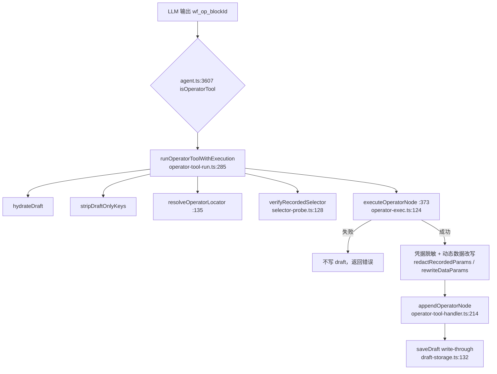
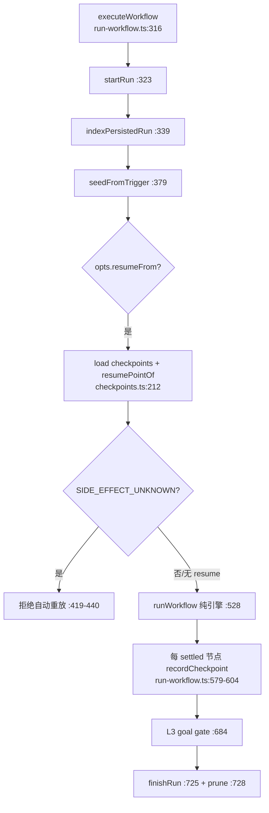

# Browser Copilot Workflow Generation & Recovery Code Map

> 对应 Spec：`docs/Browser-Copilot-Workflow-Generation-AI-Recovery-UX-Architecture-Spec.md`（Commit 01 产物）。
>
> 目标：把当前 `develop` 上 Workflow 的**生成、校验、独立验证、运行、检查点/恢复、修复、面板 UI** 的真实文件、调用链、消息链与入口逐一落图。本文所有结论均给出 `文件:行号` 与符号名，不做路径猜测；不存在“未确认路径”。
>
> 审计方法：仓库全文检索 + 实际阅读源码；测试现状同步记录。

---

## 1. 顶层结论

当前存在 **两条生成路径**、**一条执行链路**、**两套并存的 AI 修复产品**：

1. **生成路径 A（主路径，operator-draft）**：模型调用 `wf_op_<blockId>` 工具，工具调用时**真实执行** block，成功后把节点 append 进 per-conversation draft（write-through 持久化）；保存时 draft 组装为 Workflow。
2. **生成路径 B（兜底，chat-history）**：模型只调用普通浏览器工具，动作进入 action history；draft 为空时由 `workflowFromHistory` 编译为 Workflow。
3. **执行链路**：`executeWorkflow`（run 包装 + checkpoint + trace）→ `runWorkflow`（纯图解释器）→ executor（真实 CDP 动作）。
4. **修复产品 A（legacy，AI Debug session）**：`workflows.debug`——带 AI takeover 跑 → 收集参数修复 → 无接管验证 → pending → 用户应用。
5. **修复产品 B（Unified repair）**：`workflows.repair`（ANALYZE / SUGGEST / AUTO_REPAIR）——始终无接管执行 → 确定性诊断 → AI 最小补丁集 → replay → verify；verified 副本存内存待 `repairCommit`。

> 关键事实：代码**没有** “Planner 硬门槛”，主产品路径是“先在真实浏览器执行，后生成 Workflow”。后续改造保持该路径，不新增平行引擎。

---

## 2. 真实入口文件

| 角色 | 文件 | 说明 |
|---|---|---|
| Service Worker 总入口 | `src/background/index.ts` | 所有 `workflows.*` / `record.*` 消息集中分发；workflow 命令 `:1289` 起 |
| Agent / 对话编排 | `src/background/agent.ts`、`src/background/orchestrator.ts`、`src/background/task-runner.ts` | 聊天回合、工具循环；operator 工具分发在 `agent.ts:3607` |
| Operator 工具执行（路径 A） | `src/background/workflow-engine/operator-exec.ts` | `executeOperatorNode`（`:124`） |
| Operator 桥（路径 A） | `src/background/operator-tool-run.ts` | `runOperatorToolWithExecution`（`:285`）、`resolveOperatorLocator`（`:135`）、`forgetGenerationSecrets`（`:110`） |
| Draft 图与组装（路径 A） | `src/background/operator-tool-handler.ts` | append 原语、trigger head、`composeWorkflowFromDraft`（`:593`）、`declareWorkflowInputs`（`:566`） |
| Draft 持久化 | `src/lib/workflow/draft-storage.ts` | `saveDraft/loadDraft/deleteDraft`；key `workflow-drafts` |
| Draft 数据模型 | `src/lib/workflow/draft-types.ts` | `WorkflowDraft`（`:41`）、`PendingBranch`（`:24`）、`TRIGGER_BLOCK_ID`（`:14`） |
| History 编译（路径 B） | `src/background/history-compile.ts` | `resolveWorkflowForSave`（`:147`）、`compileConversationHistory` |
| History→Workflow | `src/lib/storage.ts:1900` | `workflowFromHistory`；fill 去重 `:1254` |
| 录制（第三条记录源） | `src/background/record-controller.ts`、`src/lib/workflow/record-convert.ts` | `record.start/stop`；`flowsToWorkflow`（`record-convert.ts:40`） |
| Runner / 恢复 / 副作用安全 | `src/background/workflow-engine/run-workflow.ts` | `executeWorkflow`（`:316`）、checkpoint 写入（`:579-604`）、SIDE_EFFECT_UNKNOWN 拦截（`:419-440`） |
| 纯图解释器 | `src/background/workflow-engine/engine.ts` | `runWorkflow` |
| 检查点纯逻辑 | `src/lib/workflow/checkpoints.ts` | `recordCheckpoint`、`resumePointOf`（`:212`）、`workflowFingerprintOf`（`:162`） |
| 检查点持久化 | `src/background/checkpoint-store.ts` | `createChromeCheckpointStore`（`:53`）；文件 `checkpoints/<runId>.json` |
| 生成静态校验（六层） | `src/lib/workflow/generated-validation.ts` | `validateGeneratedWorkflow`（`:420`） |
| 运行校验 | `src/lib/workflow/validation.ts`、`src/lib/workflow/integrity.ts` | `validateWorkflowForRun`、`checkWorkflowIntegrity` |
| Reliability 契约 | `src/lib/workflow/reliability.ts` | mode 解析、`NodeReliabilitySpec`、`WorkflowGoalSpec`、`nodeReliabilityOf` |
| 契约确定性补全 | `src/lib/workflow/auto-contract.ts` | `autoCompleteReliability`（`:135`）、`inferIdempotency`（`:43`） |
| Goal 派生 | `src/lib/workflow/goal.ts` | `deriveGoalSpecFromNodes`（`:56`） |
| Readiness | `src/lib/workflow/readiness.ts`、`src/background/workflow-engine/readiness-engine.ts` | spec 规范化 + 运行等待 |
| 选择器硬化 / 探测 | `src/background/selector-probe.ts` | `verifyRecordedSelector`（`:128`）、`probeWorkflowSelectors`（`:61`）、`hardenWorkflowSelectors`（`:170`） |
| 定位评分 / 指纹 | `src/lib/workflow/locator-score.ts`、`src/lib/workflow/element-fingerprint.ts`、`src/lib/workflow/target-to-selector.ts` | 候选评分、语义指纹、Target→selector |
| 凭据隔离 | `src/lib/workflow/secret-guard.ts` | `redactRecordedParams`（`:137`）、密码字段识别 |
| 缺失输入提升 | `src/lib/workflow/declare-missing-inputs.ts` | `declareMissingInputs`（`:46`） |
| 动态数据 / 输入泛化 | `src/lib/workflow/dynamic-data.ts` | `rewriteDataParams`、`buildVariableIndex`、`declareWorkflowInputs` 支撑、`mergeTriggerInputs` |
| Workflow 持久化 | `src/lib/workflow/storage.ts` | `saveWorkflow`（`:135`），含 migrate+validate |
| 触发器重排 | `src/background/workflow-triggers.ts` | `rescheduleAllWorkflowTriggers`（`:358`） |
| 修复引擎目录 | `src/background/workflow-engine/repair/` | 见 §6 |
| 修复纯原语目录 | `src/lib/workflow/repair/` | 见 §6 |

---

## 3. 生成链路（路径 A：operator-draft）

逐段真实位置：

1. **工具分发**：`src/background/agent.ts:3607` `if (isOperatorTool(name))` → `:3612` `runOperatorToolWithExecution({...})`；工具结果 JSON 回灌模型 `:3627-3664`。`isOperatorTool/blockIdFromOperatorName` 在 `src/lib/workflow/operator-tools.ts:795 / :50`，前缀 `WF_OP_PREFIX`（`:36`）。
2. **桥主流程**：`runOperatorToolWithExecution`（`operator-tool-run.ts:285-515`）顺序：
   JS escape-hatch gate（`:295`）→ `hydrateDraft`（`:300`；实现 `operator-tool-handler.ts:152`）→ `stripDraftOnlyKeys`（`:303`；`:405`，剥离 `next/workflowName/inputName/generated/justification`）→ `resolveOperatorLocator`（`:304`）→ `verifyRecordedSelector`（`:309`）→ 凭据路径检测与 locator merge（`:319-322`）→ ai-prefill / bulk-data gate / required-params gate（`:345-371`）。
3. **真实执行**：`executeOperatorNode`（`:373`；`operator-exec.ts:124`）经真实 block executors。失败 → 不写 draft（`:382-384`）。
4. **执行后**：记录首动作 `originUrl`（`:390`）→ 收割 executor 变量进 `draft.variables`，凭据变量仅留内存 secret bag（`:399-413`）→ `redactRecordedParams`（`:417`；`secret-guard.ts:137`）→ `rewriteDataParams` + `declareWorkflowInputs`（`:435-442`）。
5. **追加 + 持久化**：`appendOperatorNode`（`:468`；`operator-tool-handler.ts:214-255`），edge handle 规范化 `<blockId>-output-N → <blockId>-input-1`；分支游标 `outputSuffixOf`（`:474`；`:262`）；随后 `saveDraft`（`:489`；`draft-storage.ts:132`，per-key lock，cap 32）。

### 3.1 Draft → Workflow（组装）

- `composeWorkflowFromDraft(conversationId, {name, description, save})`（`operator-tool-handler.ts:593-680`）：
  - `actionNodesOf` 空则报错（`:598`）；`ensureTriggerHead`（`:601`；`:96`）。
  - `autoCompleteReliability(draft.nodes)`（`:615`）→ `declareMissingInputs(draft.nodes)`（`:618`）。
  - 构造 `Workflow`：`trigger: triggerFromNodes(...)`（`:623`）、settings 写 `provenance`、可选 `generationOriginUrl`（`:629-630`）、`goalSpec` 由 `deriveGoalSpecFromNodes`（`:635`；`goal.ts:56`）、`drawflow:{nodes,edges}`（`:640`）。
  - 非阻塞校验结果落 `saveWarnings`（`:650-669`）：`validateWorkflowForRun` + `validateGeneratedWorkflow`（仅 strict）。
  - `save!==false` 时 `saveWorkflow`（`:672`）并 `clearDraft`（`:674`）。

### 3.2 生成路径 B（history 兜底）

- `resolveWorkflowForSave`（`history-compile.ts:147-166`）：先 `composeWorkflowFromDraft(... save:false)`（`:151`）；draft 空则 `compileConversationHistory` → `workflowFromHistory`（`src/lib/storage.ts:1900`），source 标 `history`；都空返回 empty（`no-actions | all-failed`）。

---

## 4. 独立验证（Independent Verify）

- `workflows.draft.get` handler（`index.ts:1320-1367`）在卡片返回前调用 `verifyGeneratedDraft`（`:1354`；实现 `:434+`）。
- `verifyGeneratedDraft` → `finalizeGeneratedWorkflow`（`src/background/workflow-engine/repair/generation-repair.ts:77`）：takeover-free verify → diagnose → 有限 transient retry → 最小 AI patch → validate →（confidence gate）→ apply → replay。策略 `{maxRepairRounds:2, maxTotalDurationMs:45_000}`（`index.ts:461`）。
- 验证规则：`verification-runner.ts:8-12`，`verified = success && usedAiTakeover===false && goalAchieved!==false && structuralClean`。
- 结果随 `workflows.draft` 响应的 `repair: GeneratedWorkflowRepairInfo` 返回（**非阻塞**，不阻止保存）。

---

## 5. 运行 / 检查点 / 恢复链路

- **入口**：`executeWorkflow(workflow, opts)`（`run-workflow.ts:316`）。被 chat / scheduler / Feishu / manual / debug / repair 共用。
- **checkpoint 写入**：引擎 `onCheckpoint` → `recordCheckpoint(checkpointStore, {...})`（`run-workflow.ts:579-604`），每 settled 节点一条，携带 `workflowFingerprint`（`:600`）、`snapshotAvailable`（`:597`）、side-effect `phase`（`:602`）。
- **持久化**：`createChromeCheckpointStore`（`src/background/checkpoint-store.ts:53`）——内存热表 + 合并落盘镜像，文件 `checkpoints/<runId>.json`；保留 20 runs（`:183`）、每 run 50 条（`:21`）。
- **resume 决策（纯）**：`resumePointOf`（`checkpoints.ts:212`）：
  - `snapshotAvailable===false` 跳过（`:219`）；fingerprint 不符 → `fingerprint-mismatch`（`:220`）。
  - 节点 `ok` 且 phase 已提交 → resume 到默认边的下一节点（`:227-242`）。
  - `phase==='sideEffectStarted'` 且无观察 → 返回 `side-effect-unknown`（`:244-247`）。
- **SIDE_EFFECT_UNKNOWN 硬拦截**：`run-workflow.ts:419-440`，run 判 failed 并提前返回，不做 replay。
- **L3 goal gate**：`run-workflow.ts:684-701`，`ok` 但 goal 未达成则改写 outcome 为 failed。

---

## 6. 修复引擎（两套 + 纯原语）

### 6.1 背景修复引擎目录 `src/background/workflow-engine/repair/`

| 文件 | 职责 |
|---|---|
| `unified-debug.ts` | `runUnifiedDebug(wf, mode, deps)`（`:83`）；`UnifiedDebugMode`（`:40`）；transient retry → propose → validate → confidence gate → apply → replay |
| `repair-engine.ts` | `WorkflowRepairEngine`：verify/diagnose/propose/validatePatch/apply/replay |
| `failure-analyzer.ts` | `analyzeFailure`；TRANSIENT/HUMAN 类型表 |
| `root-cause-analyzer.ts` | `canonicalizeAnalysis / rankCandidates / sameAnalysis` |
| `repair-agent.ts` | `buildRepairContext`、`buildRepairMessages`、`parseRepairProposal`、`REPAIR_SYSTEM_PROMPT` |
| `repair-provider.ts` | `createAiRepairProposer`（OpenAI 兼容） |
| `repair-session-store.ts` | 内存 `Map<workflowId, PendingRepairSession>`（`:45`）；put/take/discard；锁基线 `baseUpdatedAt/baseHash` |
| `replay-engine.ts` | `planReplay / executeReplay`；replay 安全分类 |
| `verification-runner.ts` | `buildVerificationResult / verifyThroughRunner`；`WorkflowRunner`（`:41`）、`RunnerOutcome`（`:32`） |
| `generation-repair.ts` | `finalizeGeneratedWorkflow`（`:77`）；生成期修复循环 |
| `background-runner.ts` | `createBackgroundRunner / createBackgroundCheckpointAdapter`（真实 executeWorkflow 适配） |
| `index.ts` | barrel |

### 6.2 纯修复原语目录 `src/lib/workflow/repair/`

| 文件 | 职责 |
|---|---|
| `types.ts` | `VerificationFailureType`（`:22`，22 类）、`ExecutionTrace`、`FailureAnalysis`（`:245`）、`WorkflowPatchSet`（`:313`）、`RepairPolicy/DEFAULT_REPAIR_POLICY`（`:343/361`）、`WorkflowRepairSession`（`:408`） |
| `failure-classifier.ts` | `classifyVerificationFailure`（`:162`）、`traceFailureFrom`（`:172`）——**运行/修复链路实际使用的规范分类器** |
| `patch-engine.ts` | 补丁应用纯逻辑 |
| `patch-policy.ts` | replay 安全表（block → safety） |
| `confirmation-gate.ts` | `decideConfidence`（阈值 `autoApplyConfidenceThreshold`） |
| `transient-retry.ts` | `isTransientFailure / nextTransientRetry / transientPolicyOf / waitForTransientRetry`；退避 500/1500ms |
| `repair-response.ts` | `RepairResponseData`（`:36`）、`toRepairResponse`（`:73`）——面板线协议投影 |
| `dataflow-analyzer.ts` / `dataflow-cache.ts` | 数据流分析与缓存 |
| `failure-signature.ts` | 失败签名 |
| `failure-corpus.ts` | 离线标注语料 |
| `trace-codec.ts` | trace 版本化编解码 |
| `variable-provenance.ts` | 变量出处 |
| `redaction.ts` | 脱敏 |
| `policy-tuner.ts` | 策略调参 |
| `subworkflow-trace.ts` | 子工作流 trace |

### 6.3 第三套（背景 enriched verdict）与死代码 taxonomy

- `src/background/workflow-engine/failure-classifier.ts`：`withFailureVerdict`（`:95`）/`classifyFailure`（`:63`），委托 `src/lib/workflow/failure-code.ts` 的 `classifyFailureMessage`（`:163`），加 evidence + repairHint。仅 `engine.ts:843`（AI takeover 路径）使用。
- `src/lib/workflow/failure-code.ts`：`FailureCode`（`:14`，15 码）、`FailureCategory`（`:39`，8 类）。
- `src/lib/workflow/failure-taxonomy.ts`：16-kind `WorkflowFailureKind`（`:24`）+ adapter——**零引用死代码**。

> 当前存在**两套活跃、部分重叠的失败词表**（repair `VerificationFailureType` 与旧 `FailureCode`），统一 taxonomy 在 Commit 02 以扩展 + mapper 方式建立，不直接删旧。

---

## 7. 消息链（public 命令清单）

所有命令在 `src/lib/messages.ts` 定义、`src/background/index.ts` 处理：

| 命令 | 定义 | Handler | 结果类型 |
|---|---|---|---|
| `workflows.list` | — | `index.ts:1289` | `workflows.list {workflows}` |
| `workflows.get` | — | `:1292` | `workflows.get {workflow?}` |
| `workflows.save` | `messages.ts:191` | `:1295` | `workflows.save` |
| `workflows.delete` | — | `:1315` | `workflows.delete` |
| `workflows.draft.get` | `:199` | `:1320` | `workflows.draft`（`:421`；empty/detail/source/repair/probes/suggestions） |
| `workflows.probe` | — | `:1369` | `workflows.probe {probes}` |
| `workflows.draft.fold` | `:215` | `:1391` | `workflows.draft.fold` |
| `workflows.draft.clear` | — | `:1419` | `workflows.draft.clear` |
| `workflows.review` | `:234` | `:1430` | `workflows.review {review,error?}`（+ pushed `workflows.reviewLog`） |
| `workflows.run` | `:235` | `:1450` | `workflows.run {outcome}` |
| `workflows.resumePoint` | `:315` | `:1513` | `workflows.resumePoint {resumable,runId?,fromStepIndex?}` |
| `workflows.resume` | `:303` | `:1541` | `workflows.resume {outcome}` |
| `workflows.debug` | `:254` | `:1566` | `workflows.debug {result: WorkflowDebugResult}` |
| `workflows.repair` | `:262` | `:1920` | `workflows.repair {data: RepairResponseData}` |
| `workflows.repairCommit` | `:274` | `:1991` | `workflows.repairCommit` |
| `workflows.repairDiscard` | `:276` | `:2026` | `workflows.repairDiscard` |
| `workflows.takeoverPending` | `:278` | `:2035` | `workflows.takeoverPending {items}` |
| `workflows.takeoverStats` | `:280` | `:2038` | `workflows.takeoverStats {summary}` |
| `workflows.debugStats` | `:282` | `:2041` | `workflows.debugStats {summary}` |
| `workflows.takeoverApply` | `:284` | `:2044` | `workflows.takeoverApply`（`:511`） |
| `workflows.takeoverDiscard` | `:296` | `:2137` | `workflows.takeoverDiscard` |
| `workflows.running` | `:316` | `:2142` | — |
| `record.start` / `record.stop` / `record.status` | `:323/325/327` | `:2147/2152/2158` | — |

### 7.1 协议现状缺口（后续 commit 处理）

- repair 命令**无 `requestId`**、**无数值 revision/baseRevision**；幂等仅靠 `updatedAt + fingerprint`。
- stale commit 以**抛出英文字符串**表达（`index.ts:2006-2014`），无 typed `REVISION_CONFLICT`。
- `takeRepairSession` 在锁检查之前取走会话（`:1995`）；formal workflow 缺失时跳过锁（`:2003`）。

---

## 8. UI 入口现状

| Surface | 文件 | 现状 |
|---|---|---|
| Workflows 列表/卡片 | `src/sidepanel/WorkflowsTab.tsx` | 每卡片 actions（`:1170-1257`）：Run、Resume（条件）、**AI 调试**（`:1195`）、**AI 分析**（`:1216`）、**AI 建议修复**（`:1225`）、**AUTO_REPAIR**（`:1234`）、Edit、Export、Delete；另有 debug 日志 modal（`:1304`）、RepairDialog（`:1293`） |
| 运行动态板 | `src/sidepanel/RunningBoard.tsx` | running + finished 列表，仅 cancel/delete/clear，无 AI 按钮 |
| 历史（workflow runs） | `src/sidepanel/HistoryTab.tsx` | `RunsSection`（`:516`）展示 run/error/steps；OperationsSection（`:738`）有 history→workflow review |
| 修复结果弹窗 | `src/sidepanel/RepairDialog.tsx` | failed/root-cause/variable rows/patch before→after/verified 状态/commit+discard |
| Chat 保存卡 | `src/sidepanel/ChatTab.tsx` | `maybePromptSaveWorkflow`（`:1765`）、probe（`:1838`）、integrity、save（`:2671`） |
| Workflow review 列表 | `src/sidepanel/WorkflowReviewList.tsx` | history review 列表 |

> **待收敛**：失败面板当前存在五个语义重叠的 AI 平级按钮；Commit 11/13 收敛为单一 `AI 修复` + 两个用户确认点。

---

## 9. 测试现状

- 测试栈：Vitest 3（node 环境，`.tsx` 用 react-dom/server）；配置 `vite.config.ts:86-100`；include `tests/**/*.spec.ts(x)`；无 `src/` 内测试。
- 基线（本次审计时）：**212 test files / 2581 tests 全绿**。
- 相关测试分组：
  - 生成/draft：`operator-draft-graph`、`operator-draft-durability`、`workflow-draft-storage`、`workflow-from-history`、`workflow-ir`、`workflow-inputs`、`generated-validation`、`readiness-engine`、`runnability`、`semantic-locator`、`locator-score`。
  - 修复：`tests/repair/*`（unified-debug、patch-engine、replay、verification、session-save、confirmation-gate、repair-response、root-cause、failure-signature、transient-retry 等）、`debug-session`、`auto-debug-patch`、`rewrite-risk`、`review-patch`。
  - 检查点：`checkpoints`、`checkpoint-store`、`engine-checkpoints`、`ai-takeover`、`takeover-pending`、`takeover-stats`。
  - 分类：`failure-classifier`、`failure-taxonomy`、`tests/repair/failure-corpus`。
  - benchmark：`tests/bench/debug-bench.spec.ts`、`tests/reliability-benchmark.spec.ts`、`tests/bench/baseline-report.spec.ts`（产物 `tests/bench/baseline.json`，`UPDATE_BASELINE=1` 更新）；fixtures 在 `specs/reliability-fixtures/`。
- **无真实浏览器 E2E**（仓库明确排除）；Playwright 仅用于独立 `server/` runner。

---

## 10. 已确认的死/冗余代码（本 Spec 不强制删除，仅记录）

- 死代码：`src/lib/workflow/ir.ts`（`compileIR` 无消费者）、`reliability-certification.ts`、`reliability-patch.ts`、`apply-verify.ts`、`failure-taxonomy.ts`。
- 测试专用：`runOperatorTool`（`operator-tool-handler.ts:299`，非执行路径）。
- 重复：三套 unsafe verb 表（`auto-contract.ts:24` / `generated-validation.ts:91` / `reliability.ts`）、两套失败签名（`repair/failure-signature.ts` 与 `failure-memory.ts`/`ai-takeover.ts`）、三套 record/compile（`flowsToWorkflow` / `workflowFromHistory` / operator append）。

---

## 11. 后续 Commit 索引

- Commit 02 统一 failure classification model（扩展，不删旧）。
- Commit 03 新增 Normalize 阶段；04 输入泛化；05 统一 locator resolver；06 契约自动构建；07 生成 pipeline 化。
- Commit 08 单入口 recovery orchestrator；09 class-aware budget；10 recovery 消息协议。
- Commit 11 单入口 Failure Center；12 proposal diff/risk；13 删除二级 AI 按钮；14 revisioned commit；15 Workflow Health。
